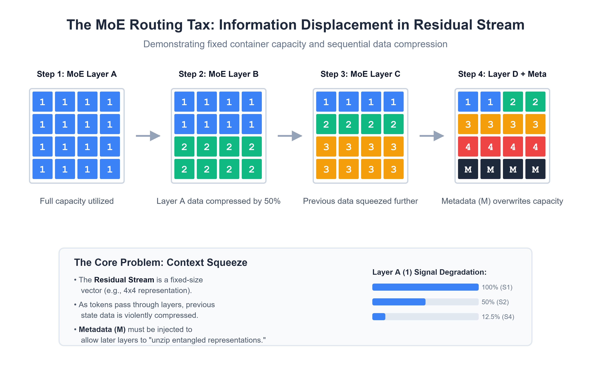

Hey

We generally assume that the hundreds of billions of parameters in Attention and MoE layers are dedicated entirely to cognitive work: reasoning, recalling facts, and extracting logical patterns. We like to think of our models as pure, crystallized knowledge bases.

But if you look at the information physics of the classical Residual Stream, a fundamental architectural flaw emerges. Because the standard depth-wise pipeline was left "to its own devices" without a dedicated routing bus, SGD had to improvise. And it did so by repurposing a massive chunk of the network's working parameters to build heavy-weight communication protocols.

I call this the **"Hidden Routing Tax."** Here is a conceptual breakdown of why standard Transformers are forced to act like glorified ZIP-archivers, why magnitude growth is a feature rather than a bug, and how recent empirical data points toward a future of cyclic latent diffusion architectures.

*(Disclaimer: I'm an independent software engineer, not a researcher at a massive AI lab. This is a conceptual architectural framework to explain the physical behavior of SGD under routing constraints, supported by recent empirical papers. Treat this as an invitation to discuss architectural bottlenecks).*

---

### 1. The Blind Pipeline & Forced Cryptography

Let's start with the basics. The traditional Transformer relies on fixed residual connections (a legacy of 2015 ResNet): 

`x_{l+1} = x_l + F_l(x_l)`

This is **blind accumulation**. The network indiscriminately compresses all preceding information into a single state, with no mechanism to selectively route data. If Layer 5 needs to pass a critical entity name to Layer 50, that fragile numeric signal must survive matrix multiplications through 44 intermediate blocks.

Because the network lacks direct addressability (Layer 50 can't dynamically "query" Layer 5), a hidden logistical infrastructure emerges inside the weights:

1. **Hidden Serialization (Packing):** The early layer doesn't just encode the fact; under the pressure of the loss function, it encrypts knowledge into a high-dimensional superposition (polysemanticity) and attaches a hidden routing key.
2. **Forced Feature Entanglement:** Intermediate layers act as forced couriers. They have to spend their compute budget carefully carrying these archived packets, entangling the transit signal with their own outputs so it isn't destroyed by interference.
3. **Deserialization (Unpacking):** Deep layers spend millions of parameters building "decoders" to filter out the accumulated noise, recognize the key, and unzip the container before performing actual reasoning.

**TL;DR:** You are paying a massive "Routing Tax." A huge portion of your parameter count isn't reasoning; it's just maintaining a functional postal service. 

### 2. "PreNorm Dilution" is an Evolutionary Strategy

Academic papers frequently describe **PreNorm Dilution** (the uncontrolled growth of vector values as they propagate, typically scaling at $\mathcal{O}(\sqrt{L})$) as a mathematical bug of fixed accumulation. Engineers have spent years adding RMSNorm/LayerNorm bandages to prevent exploding gradients.

But look at the loss landscape through the routing lens: **Vector bloat is not a bug. It is an evolutionary adaptation.**

SGD lacks architectural foresight. When dozens of blocks try to cram their encrypted archives into one narrow residual pipe, the interference is brutal. How does Layer 5 ensure its archive doesn't get erased by Layer 30's additions? 

*SGD's answer: Make the signal mathematically "scream".* 

Layers are forced to exponentially increase the L2-norm of their outputs so their representations dominate the downstream noise. It is the only physical way for SGD to deliver a signal across a blind pipeline. Vector bloat is just a cry for help from a network lacking a selective data bus.

### 3. The MoE Bottleneck & "Defensive Duplication"

MoE was supposed to be a clean base of specialized experts. But because the Transformer is a strict Directed Acyclic Graph (DAG), experts are flying blind. 

There is no backward feedback loop. Modern MoE routers (e.g., Top-K) select experts based solely on the *current* state of the vector. Early layers have no way to ask Layer 50: *"What specific facets of this concept will you actually need for the final output?"*

Because they cannot architecturally revise their representations, early MoE routers resort to **Defensive Duplication**. They cache and transmit redundant primitives, overlapping contexts, and bloated representations "just in case" the terminal layers need them. This inability to "reconsider" a hypothesis drives massive parameter bloat (e.g., 48B total params, but only 3B active) and is the root cause of logical hallucinations in System 2 thinking.

### 4. Empirical Proof: Attention Residuals & the $\mathcal{O}(L^2)$ Memory Compromise

The industry is finally addressing this. The recent *Attention Residuals* preprint (Moonshot AI / Kimi, *arXiv:2603.15031*) perfectly validates the "routing tax" hypothesis. 

They replaced rigid accumulation with a trainable softmax attention mechanism **along the depth axis**. Later layers get a pseudo-query vector and can dynamically access raw facts from *any* previous layer: 

`x_l = Σ α_{l,i} F_i(x_i)`

**The physical result?** The need for early layers to "scream" vanished instantly. PreNorm dilution disappeared, and gradient norms distributed evenly. 

However, full Attention Residuals require a layer to keep the outputs of *all* previous layers in memory, creating a catastrophic **$\mathcal{O}(L^2)$ memory bottleneck** that kills pipeline parallelism. 

To make it work, they introduced *Block Attention Residuals*—grouping layers into macro-blocks, keeping blind addition *inside* the block (retaining a local tax), but using selective attention *between* blocks. Even with this compromise, freeing parameters from the routing tax resulted in a massive boost in reasoning tasks (Kimi Linear baseline vs Block AttnRes):

| Benchmark Category | Dataset | Baseline (Blind Accumulation) | Block Attention Residuals | Absolute Gain |
| :--- | :--- | :---: | :---: | :---: |
| **Complex Reasoning** | GPQA-Diamond | 36.9 | 44.4 | **+7.5** |
| **Math** | Math | 53.5 | 57.1 | **+3.6** |
| **Coding** | HumanEval | 59.1 | 62.2 | **+3.1** |

But the core flaw remains: **The pipeline is still strictly unidirectional.** Layer 50 can query Layer 5, but Layer 5 *still* doesn't know what Layer 50 will need when it activates. The root cause of Defensive Duplication is untouched.

### 5. The Endgame: Latent Cognitive Diffusion 

How do we eliminate defensive duplication and give the network true reflection? We have to break the DAG. The answer lies in a hybrid between MoE routing and diffusion model principles operating directly in the Latent Space.

We already know the industry is willing to trade Test-Time Compute for System 2 reasoning quality. The future forward pass cannot be linear; it must be an **Iterative Consensus Loop**:

1. **Primary Diffusion (Hypothesis Cloud):** MoE experts unpack their knowledge slices in parallel, generating a multidimensional cloud of raw hypotheses.
2. **Reverse Cross-Reflection:** Hidden states do not blindly move forward. They are routed *backward* through the experts. A deep logic expert can hardware-correct and request specific supplements from an early factual expert.
3. **Consensus Collapse:** Iterative denoising continues until experts resolve contradictions. Only then does the latent cloud collapse into a deterministic output vector.

Routing multi-dimensional tensors bi-directionally in a cycle crushes Time-to-First-Token and requires massive HBM innovations (echoing Continuous-Time RNN theories). But the vector is set. 

Once networks stop acting as unidirectional courier-archivers, they will reclaim billions of parameters from the routing tax and become true *Latent Cognitive Diffusion* systems—where knowledge isn't just transmitted, but iteratively comprehended.
